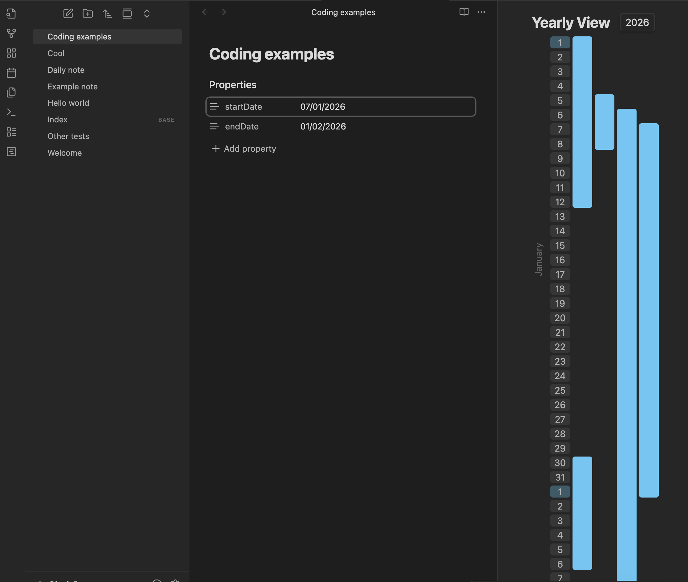
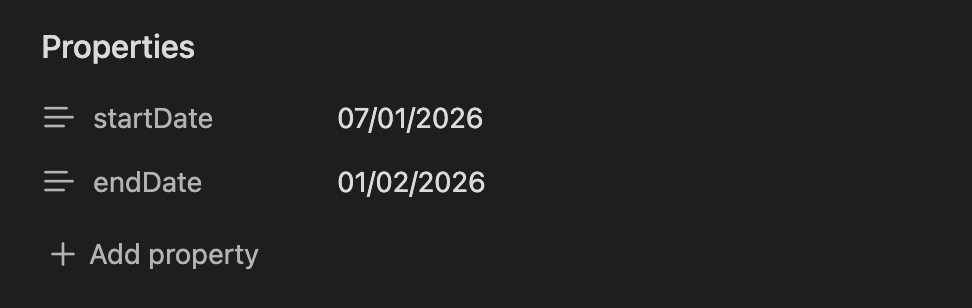
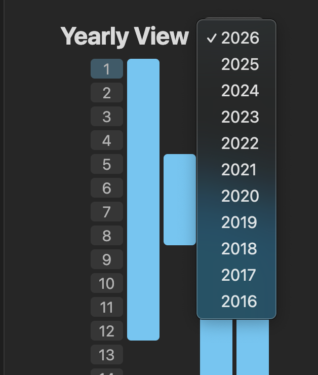

# Yearly Timeline

A visually intuitive vertical timeline plugin for Obsidian that allows you to track and visualize your notes across a yearly view.

## Screenshots

<!-- Add your screenshots here -->
<p align="center">
  
</p>

<p align="center">
  
</p>

<p align="center">
  
</p>

## How to use

1. Install the plugin and enable it in your Obsidian settings.
2. Click on the **Activate view** icon in the left ribbon (looks like a Gantt chart) to open the timeline view.
3. Use the year selector at the top to navigate between different years.

## Frontmatter Configuration

To display a note on the timeline, you need to add specific fields to your note's frontmatter (YAML). The plugin automatically picks up any note that contains at least a `startDate`.

### Required Date Format
Dates MUST follow the `DD/MM/YYYY` format. (Day, Month, Year).

### Fields
- `startDate`: **(Required)** The start date of the event or note.
- `endDate`: *(Optional)* The end date. If not provided, it defaults to the `startDate` (representing a single-day event).

### Example

```yaml
---
startDate: 10/01/2026
endDate: 25/01/2026
---
```

## Features

- **Yearly Perspective**: See your entire year's activities at a glance in a vertical layout.
- **Overlap Handling**: Automatically organizes overlapping notes into separate columns (supports up to 5 concurrent overlaps).
- **Interactive Navigation**: Click on any block in the timeline to instantly open the associated note.
- **Real-time Updates**: The view refreshes automatically whenever you update the frontmatter dates in your notes.
- **Leap Year Support**: Full support for leap years and varying month lengths.


