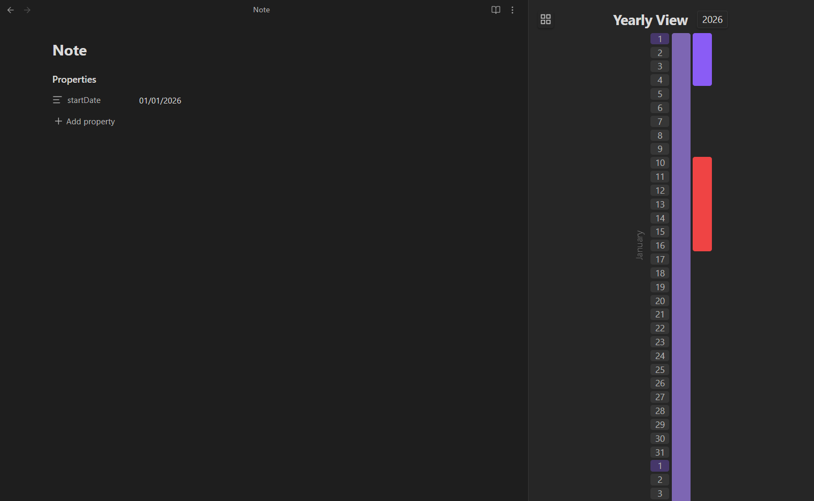
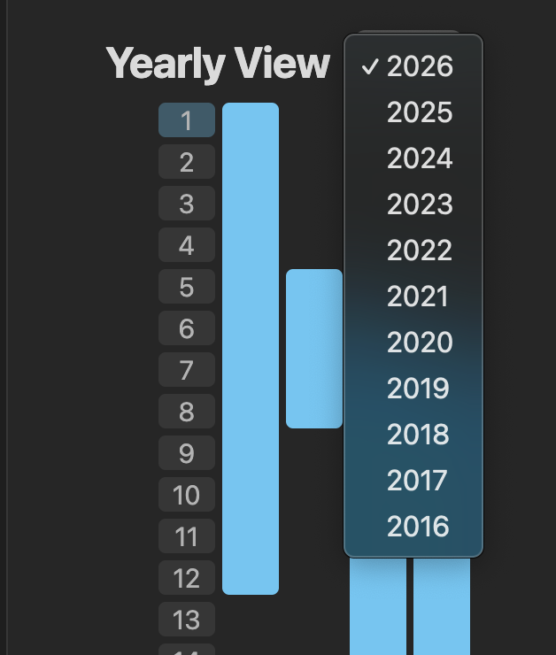
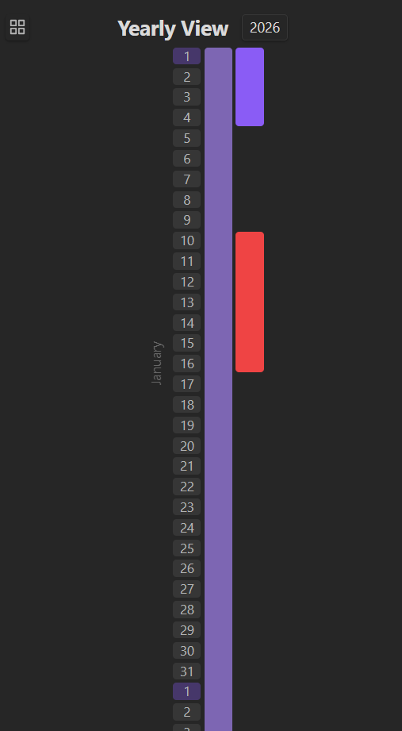
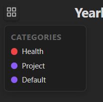

# Yearly Timeline

A visually intuitive vertical timeline plugin for Obsidian that allows you to track and visualize your notes across a yearly view.

<p align="center">
  
</p>
<p align="center">
  
</p>

## How to use

1. Install the plugin and enable it in your Obsidian settings.
2. Click on the **Activate view** icon in the left ribbon (looks like a Gantt chart) to open the timeline view.
3. Use the year selector at the top to navigate between different years.

## Frontmatter Configuration

To display a note on the timeline, you need to add specific fields to your note's frontmatter (YAML). The plugin automatically picks up any note that contains at least a `startDate`.

### Required Date Format
Dates MUST follow the `DD/MM/YYYY` format. (Day, Month, Year).

### Fields
- `startDate`: **(Required)** The start date of the event or note.
- `endDate`: *(Optional)* The end date.
    - If provided: The note is marked as **Done** (100% saturation).
    - If not provided: The note is marked as **In-Progress** (50% saturation) and automatically extends to today's date.
- `name`: *(Optional)* The name of the event or note. If not provided, the plugin will use the file name.
- `category`: *(Optional)* Categorizes the note for color-coding. The plugin automatically assigns one of 12 vibrant colors to any new category it discovers.

## Status & Appearance

The plugin automatically determines the status and visual style of a note based on its properties:

| Status | Frontmatter Requirement | Appearance |
| :--- | :--- | :--- |
| **Todo** | No `startDate` | Hidden from timeline |
| **In-Progress** | `startDate` but no `endDate` | 50% Saturation, ends today |
| **Done** | Both `startDate` and `endDate` | 100% Saturation |

<p align="center">
  
</p>

### Category Colors
Notes are colored based on their `category`. The plugin uses a dynamic 12-color palette, assigning colors in the order categories are discovered (chronologically by note date). A legend button in the top-left of the timeline view shows the current mapping. If no category is provided, the default theme accent color is used.

<p align="center">
  
</p>

### Example

```yaml
---
startDate: 10/01/2026
endDate: 25/01/2026
category: work
---
```


## Features

- **Yearly Perspective**: See your entire year's activities at a glance in a vertical layout.
- **Category Color Coding**: Automatically assigns one of 12 vibrant colors to categories discovered in your notes.
- **Progress Visualization**: Automatically distinguishes between "In-Progress" and "Completed" notes using saturation levels.
- **Dynamic Legend**: Access a quick legend in the top-left to see active categories and their colors.
- **Overlap Handling**: Automatically organizes overlapping notes into separate columns.
- **Interactive Navigation**: Click on any block in the timeline to instantly open the associated note.
- **Leap Year Support**: Full support for leap years and varying month lengths.


